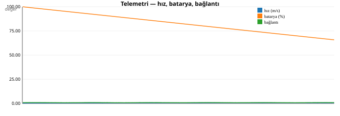
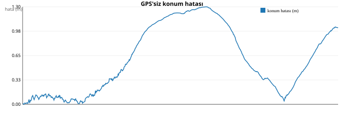
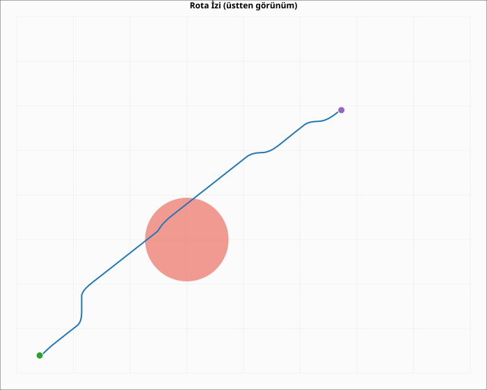

# TRUSTIA GÖREV RAPORU

- **Kayıt:** `C:\Users\Murat\Desktop\Trustia\Trustia\docs\reports\asama3\G-A01.jsonl`
- **Çerçeve sayısı:** 684

## 1. SONUÇ

| Alan | Değer |
|---|---|
| Görev kimliği | G-A01 |
| Görev tipi | kesif |
| Başarı | EVET |
| Süre | 68.5 sn |
| Adım | 685 |
| Çarpışma | hayır |
| GPS'siz konum hatası (ort) | 0.6003 m |
| Rota sapması (ort) | 1.8193 m |
| Engel tepki süresi (ort) | 0.0 sn |

## 2. TELEMETRİ ÖZETİ

| Metrik | Değer |
|---|---|
| Ortalama hız | 0.582 m/s |
| Maksimum hız | 0.774 m/s |
| Ortalama konum hatası | 0.6 m |
| Maksimum konum hatası | 1.303 m |
| En düşük bağlantı kalitesi | 0.767 |
| Ortalama batarya | %82.88 |

## 3. GRAFİKLER

## 4. OLAYLAR

_Kayıtlı olay yok._

## 5. HATA ANALİZİ

Görev başarıyla tamamlandı; hata analizi gerekmedi.
