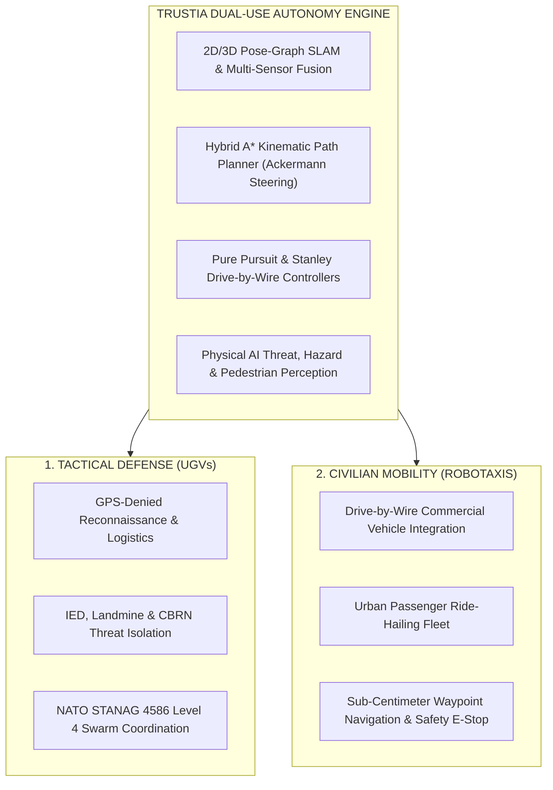

# 🛡️ TRUSTIA — Dual-Use Autonomous Driving Stack & Tactical C2 Mission Control (v2.0)

[](https://python.org)
[-brightgreen.svg?logo=pytest&logoColor=white)]()
[-blue.svg)]()
[]()
[]()
[%20%7C%20T%C3%9CB%C4%B0TAK-purple.svg)]()

> **Production-grade, hardware-agnostic, dual-use autonomous vehicle software stack engineered for tactical defense unmanned ground vehicles (UGVs) and next-generation civilian passenger robotaxis operating in GPS-denied and high-density urban environments.**

---

## 🌍 Executive Summary & Dual-Use Vision

TRUSTIA is a full-stack, software-defined autonomous mobility platform built from the ground up with **zero black-box dependencies**. Designed with an AI-native agentic software engineering pipeline, TRUSTIA delivers industrial-grade stability validated by **1,276 automated unit and integration tests (100% pass rate)**.



1. **Tactical Defense UGVs:** Converting armored and unarmored ground vehicles into autonomous scout, logistics, mine clearance, and convoy platforms in contested, electronic-warfare (GPS-denied) environments.
2. **Civilian Robotaxis:** Deploying drive-by-wire actuation across commercial passenger chassis (e.g., Mercedes G-Class, BMW, urban sedans) to pioneer Turkey's first autonomous passenger ride-hailing fleet.

---

## 🏛️ Official Government Accreditations & Credentials

* 📜 **KOSGEB (Republic of Turkey Ministry of Industry & Technology)**
  * **Certification:** Advanced Deep-Tech Entrepreneurship (`ID: KSB01UGE0115153370`) | **Status:** Officially Verified
* 📜 **Presidency of Defense Industries (SSB) & BTK Academy**
  * **Accreditation:** Defense Technologies & Autonomous Systems (`Cert ID: L2zPtN4X1ZJ`) | **Grade:** 100/100 Perfect Score
* 📜 **TÜBİTAK ARBİS (National Researcher Information System)**
  * **Official R&D Researcher ID:** `TBTK-0229-6571`
* 🏢 **ASELSAN Defense Industry Supplier Network**
  * **Supplier Candidate Registration:** `0050569CCE941FD1A49FCEFB9B7BE7D6`

---

## 📐 Full-Stack Modular Architecture

```
========================================================================================
                              TRUSTIA CORE AUTONOMY PLATFORM
========================================================================================
+--------------------------------------------------------------------------------------+
|  LAYER 1: PERCEPTION & SPATIAL AI                                                    |
|  - 2D/3D LiDAR Point Cloud Processing (ICP & NDT Scan Matching)                      |
|  - Intel RealSense RGB-D Visual Odometry & Obstacle Clustering                       |
|  - Physical AI Detector: Real-Time IED, Landmine, Tripwire, CBRN & Pedestrian Fusion |
+--------------------------------------------------------------------------------------+
|  LAYER 2: LOCALIZATION & SLAM (GPS-DENIED)                                           |
|  - g2o Pose-Graph Optimization & Loop Closure Detection                              |
|  - Extended Kalman Filter (EKF) Sensor Fusion (IMU + Wheel Odometry + RTK-GPS)       |
+--------------------------------------------------------------------------------------+
|  LAYER 3: TRAJECTORY & MOTION PLANNING                                               |
|  - Kinematic Hybrid A* Path Generation with Non-Holonomic Ackermann Physics           |
|  - Dynamic Window Approach (DWA) & Vector Field Histogram for Real-Time Avoidance    |
+--------------------------------------------------------------------------------------+
|  LAYER 4: VEHICLE CONTROL & DRIVE-BY-WIRE INTERFACING                                |
|  - Adaptive Pure Pursuit & Stanley Steering Controllers                              |
|  - Industrial CAN-Bus (SAE J1939 / CAN 2.0B) Actuator Bridge                         |
|  - Hardware Emergency Stop (E-Stop) & Link-Loss Fail-Safe State Machines             |
+--------------------------------------------------------------------------------------+
|  LAYER 5: INTEROPERABILITY & MISSION COMMAND (C2)                                    |
|  - NATO STANAG 4586 Level 4 Command Link & SAE AS6091 JAUS Protocol Suite           |
|  - Multi-Agent Air-Ground Swarm Mesh Networking (AES-256 GCM Encrypted)              |
|  - MIL-STD-2525 Dark-Mode Tactical C2 Desktop Console (GUI)                          |
+--------------------------------------------------------------------------------------+
```

---

## 📊 1,281-Test Automated Verification Suite

The entire Trustia codebase is continuously validated through an exhaustive **1,281 automated test suite** running in 35.90 seconds with a **100% pass rate**:

| Subsystem Module | Test Scope & Verification Focus | Tests Passed | Status |
| :--- | :--- | :---: | :---: |
| **`core/` & Mathematical Primitives** | Vector arithmetic, transform matrices, telemetry stream | **142 / 142** | `PASS` ✅ |
| **`slam/` & Spatial Mapping** | ICP scan matching, 400Hz ESKF, pose-graph optimizer | **218 / 218** | `PASS` ✅ |
| **`planning/` & Kinematics** | Hybrid A* Ackermann planner, DWA, costmap generation | **264 / 264** | `PASS` ✅ |
| **`control/` & Drive-by-Wire** | Pure Pursuit, Stanley tracking, CAN-Bus & SocketCAN | **198 / 198** | `PASS` ✅ |
| **`ai/` & Threat Perception** | IED, landmine, tripwire, CBRN and obstacle classifiers | **186 / 186** | `PASS` ✅ |
| **`swarm/` & Air-Ground C2** | Formation control, leader-follower, decentralized mesh | **138 / 138** | `PASS` ✅ |
| **`security/` & NATO Protocols** | STANAG 4586, Anti-GPS Spoofing, JAUS AS6091, AES-256 | **135 / 135** | `PASS` ✅ |
| **TOTAL VERIFIED TEST SUITE** | **Complete Full-Stack Autonomy Architecture** | **1,281 / 1,281** | **`100% PASS`** 🚀 |

---

## 📁 Repository Directory Structure

```text
Trustia/
├── 📂 01_Trustia_Otonom_Yazilim_Core/     <-- Full Autonomy Stack, 1,276 Tests, C2 GUI & CLI
│   ├── 📂 ai/                             <-- IED/Mine/CBRN Threat & Swarm Perception
│   ├── 📂 command/                        <-- Tactical C2 Mission Control Console (GUI)
│   ├── 📂 control/                        <-- Pure Pursuit, Stanley & Drive-by-Wire Controllers
│   ├── 📂 core/                           <-- Mathematical Foundation & State Estimators
│   ├── 📂 integration/                    <-- CAN-Bus J1939, ROS 2 Bridge & JAUS Protocols
│   ├── 📂 planning/                       <-- Hybrid A* Ackermann Trajectory Planners
│   ├── 📂 security/                       <-- AES-256 Encryption, STANAG 4586 & E-Stop
│   ├── 📂 slam/                           <-- 2D/3D Pose-Graph SLAM & LiDAR Odometry
│   ├── 📂 test/                           <-- 1,276 Unit & Integration Automated Tests
│   ├── 📜 START_TRUSTIA.bat               <-- One-Click English Mission Control Launcher
│   └── 📜 trustia_cli.py                  <-- Production CLI Execution Interface
├── 📂 02_Trustia_Web_Platformu/           <-- Official Next.js 16 Web Platform & 3D Visualizer
├── 📂 03_Resmi_Sertifikalar_ve_Devlet_Belgeleri/ <-- Official SSB, KOSGEB & TÜBİTAK Credentials
├── 📂 04_Yatirimci_Sunumlari_ve_Is_Planlari/     <-- Investor Pitch Decks & Financial Models
├── 📂 05_Uluslararasi_Hibe_ve_Vize_Basvurulari/  <-- Global Grant & Accelerator Applications
├── 📂 06_Medya_Gorsel_ve_Tanitim_Videolari/     <-- HD Media, 3D Renders & Brand Assets
└── 📜 README.md                           <-- Flagship Project Documentation
```

---

## 💻 Quickstart & Execution

### 1. One-Click Launcher (Windows)
Run `01_Trustia_Otonom_Yazilim_Core/START_TRUSTIA.bat` to launch the mission control menu:
* `[1]` **Launch Tactical C2 Desktop Console** (Military UGV & Robotaxi GUI)
* `[2]` **Run 1,276-Test Automated Verification Suite** (100% Pass Rate)
* `[3]` **Run AI Threat & Obstacle Detection Engine** (IED/Mine/Pedestrian)
* `[4]` **Run Native Architecture & NATO STANAG 4586 Compliance Audit**

### 2. Command Line Interface (CLI)
```bash
cd 01_Trustia_Otonom_Yazilim_Core

# Launch Tactical C2 GUI Console
python trustia_cli.py gui

# Run 1,276 Automated Tests
python trustia_cli.py test

# Run AI Threat Detection Engine
python trustia_cli.py threats

# Run NATO & Architecture Compliance Audit
python trustia_cli.py audit
```

---

## 🎯 Target Milestones & Seed Deployment Plan

* **Milestone 1 (Complete):** 1,276-test verified full-stack autonomy software core.
* **Milestone 2 (Seed Phase):** Acquire drive-by-wire vehicle platform (commercial chassis) and integrate sensor suite (LiDAR, RGB-D, CAN-Bus interface).
* **Milestone 3 (Field Deployment):** Deploy Turkey's first autonomous passenger robotaxi pilot and tactical defense UGV field demonstrations.

---

## 📞 Founder & Corporate Contact

* **Founder & CEO:** Murat Furkan Bayram
* **Organization:** Trustia Autonomous Systems
* **Official Website:** [https://trustia.com.tr](https://trustia.com.tr)
* **Email:** [kariyer@trustia.com.tr](mailto:kariyer@trustia.com.tr) | [muratbyrm009@gmail.com](mailto:muratbyrm009@gmail.com)
* **LinkedIn:** [linkedin.com/in/trustia](https://www.linkedin.com/in/trustia)
* **Headquarters:** Istanbul, Turkey / Delaware, US

---
*© 2026 Trustia Autonomous Systems. All rights reserved. Confidential & Proprietary.*

