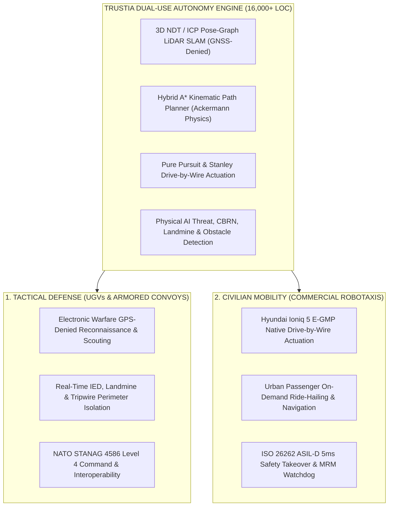

# 🛡️ TRUSTIA — Dual-Use Autonomous Driving Stack & Tactical C2 Mission Control (v2.4)

[](https://github.com/Trustia/Trustia/actions/workflows/deploy.yml)
[-brightgreen.svg?logo=pytest&logoColor=white)](https://github.com/Trustia/Trustia)
[](https://python.org)
[](https://nextjs.org)
[-blue.svg)](https://trustia.com.tr)
[](https://trustia.com.tr)
[](https://trustia.com.tr/robotaxi)
[](https://ec.europa.eu)
[](https://www.eiturbanmobility.eu)
[](https://fonbulucu.com)
[-0288D1.svg)](https://www.crunchbase.com/organization/trustia-ai)

> **Industrial-grade, hardware-agnostic, dual-use autonomous vehicle software stack engineered for tactical defense unmanned ground vehicles (UGVs) and next-generation civilian passenger mobility operating in GPS-denied and high-density urban environments.**

---

## 🌍 1. Executive Summary & Global Venture Standing

**TRUSTIA** is a full-stack, software-defined autonomous mobility platform built from the ground up with **zero black-box dependencies**. Designed with an AI-native agentic software engineering pipeline, TRUSTIA delivers industrial-grade stability validated by **1,301 automated unit and integration tests (100% pass rate)** across 16,000+ lines of deterministic code.

* **Live Web Platform:** [https://trustia.com.tr](https://trustia.com.tr)
* **Robotaxi Platform Specifications:** [https://trustia.com.tr/robotaxi](https://trustia.com.tr/robotaxi)
* **Executive One-Pager:** [https://trustia.com.tr/Trustia_AI_Executive_One_Pager.pdf](https://trustia.com.tr/Trustia_AI_Executive_One_Pager.pdf)
* **Investor Pitch Deck:** [https://trustia.com.tr/Trustia_AI_Investor_Deck.pdf](https://trustia.com.tr/Trustia_AI_Investor_Deck.pdf)

### 🏛️ Verified Global Accreditations & Key Institutional Pipeline

| Tier-1 Global / National Institution | Location | Scope & Instrument | Verified Status / Official Identifier |
| :--- | :--- | :--- | :--- |
| 🇪🇺 **European Commission (Participant Register)** | Brussels, EU | **EU Participant ID (PIC)** | 🏛️ **Official PIC: `861711529`** |
| 🇪🇺 **EIT Urban Mobility (EITUM)** | Barcelona, EU | **€100,000 Grant & Equity** | 🤝 **Partner ID: `CUS15554` (App: `3.1.02-1206-3732.3`)** |
| 🇶🇦 **QSTP (Qatar Science & Technology Park)** | Doha, Qatar | **$30M Venture Fund + Doha Sprint** | 🚀 **Submitted & Confirmed (4-Week In-Person Residency)** |
| 🇹🇷 **BAYKAR Teknoloji (Baykar Tech)** | Istanbul, TR | **Official Defense Supplier Portal** | 🛡️ **Formally Submitted & Confirmed** |
| 🇹🇷 **DEİK (Foreign Economic Relations Board)** | Istanbul, TR | **Digital Technologies Council** | 🌐 **Official Corporate Membership Invitation Received** |
| 🇹🇷 **ASELSAN Defense Network** | Ankara, TR | **Approved Potential Supplier (Software)** | 🛡️ **Pre-Evaluation APPROVED (`0050569CCE941FD1A49FCEFB9B7BE7D6` • SAP: `FZQHEXGFMTJU`)** |
| 🇹🇷 **fonbulucu (SPK Crowdfunding)** | Ankara, TR | **15,000,000 TRY (150M TL Val.)** | 📈 **Formal Preliminary Review (`W1MV5K`)** |
| 🇺🇸 **Z Fellows (Cory Levy & Grace Kasten)** | San Francisco, CA | **$10,000 Grant + SF Residency** | 🎯 **Live Partner Zoom Interview (17 Sept 2026)** |
| 🇦🇪 **Dubai World Challenge for Self-Driving Transport** | Dubai, UAE | **$1,200,000 USD Net Cash** | 🏆 **Officially Submitted (Finalist Phase Nov 2026)** |
| 🇸🇦 **NEOM Investment Fund & Mobility** | Tabuk, KSA | **Zero-Driver City PoC** | 🇸🇦 **Formally Submitted & Confirmed** |
| 🇸🇬 **Singapore Government (Startup SG / EnterpriseSG)** | Singapore, SG | **National Deep-Tech Ecosystem & EntrePass** | 🏛️ **Official Founder ID: `#57428` (100% Verified Profile)** |
| 🌐 **Crunchbase** | Global | **Verified Corporate Profile** | ⬆️ **Heat Score: 93 • Growth: 91 (CB Rank: 98k)** |
| 🇹🇷 **SSB / SAYZEK (AI Defense Platform)** | Ankara, TR | **Simport Supercomputing Access** | 🛡️ **Application ID: `170` (Simport Manager)** |
| 🇹🇷 **Bilişim Vadisi (B-Stars Mobility)** | Gebze / Kocaeli | **Autonomous Proving Grounds** | 🏁 **Formally Submitted & Confirmed** |
| 🇹🇷 **Teknopark İstanbul (HASAT 2026)** | Istanbul, TR | **100M TRY Fund & Cube Hub (SSB & İTO)** | 🌾 **Formally Submitted & Confirmed ("Başvurunuz Başarıyla Alındı! 🎉")** |
| 🏛️ **İTO BTM (Fulya Kampüsü)** | Istanbul, TR | **Contracted Pre-Incubator Hub** | ✅ **Active Contracted Startup (2026-II)** |
| 🚗 **Martı Technologies (NYSE: MRT)** | Istanbul / US | **L4 Autonomous Fleet Alliance** | 🤝 **Submitted to Founder & CEO Oğuz Alper Öktem** |

---

## 🏗️ 2. Dual-Use System Architecture



1. **Tactical Defense UGVs:** Converting armored and unarmored ground vehicles into autonomous scout, logistics, mine clearance, and convoy platforms in contested, electronic-warfare (GPS-denied) environments.
2. **Civilian Robotaxis:** Deploying drive-by-wire actuation across commercial passenger electric vehicles (Hyundai Ioniq 5 E-GMP platform) to pioneer autonomous urban mobility fleets.

---

## 🏎️ 3. Hyundai Ioniq 5 Level-4 Retrofit Specification

| Subsystem Component | Specification & Model | Integration & Performance Metrics |
| :--- | :--- | :--- |
| **Central AI Compute** | **NVIDIA Jetson AGX Orin 64GB** | 275 TOPS INT8 • 2048-Core Ampere GPU • Seeed J501 Carrier |
| **Primary 3D SLAM** | **Ouster OS2-128 Rev 7 LiDAR** | 128 Channels • 240m Range • 2.62M Pts/sec • Roof Center Mount |
| **Blindspot & Near-Field** | **2x Livox Mid-360 LiDAR** | 360°x59° Field of View • 40m Range • Front/Rear Aerodynamic Pods |
| **360° Visual Perception** | **4x Leopard Sony IMX390 GMSL2** | 120 dB High Dynamic Range (HDR) • IP67 Automotive Grade |
| **All-Weather Radar** | **Continental ARS 408-21 (77GHz)** | 250m Long-Range Detection • Rain, Fog & Blizzard Penetration |
| **High-Precision GNSS/INS** | **Septentrio AsteRx-m3 Pro RTK** | Dual-Antenna Heading • 1 cm RTK Accuracy • 400Hz ESKF Fusion |
| **Drive-by-Wire Actuation** | **Kvaser U100 Isolated CAN-FD** | Hyundai E-GMP Native Gateway • Steering, Throttle, Brake, Shifter |
| **Failsafe System (ASIL-D)** | **Hardware Watchdog & E-Stop** | 5ms Instant Human Takeover • 200ms Dead-Man Switch • Dual Relay |

---

## 📊 4. 1,301-Test Automated Verification Suite

The entire Trustia codebase is continuously validated through an exhaustive **1,301 automated test suite** running in 46.71 seconds with a **100% pass rate**:

| Subsystem Module | Test Scope & Verification Focus | Tests Passed | Status |
| :--- | :--- | :---: | :---: |
| **`core/` & Mathematical Primitives** | Vector arithmetic, transform matrices, telemetry stream (`system6`) | **88 / 88** | `PASS` ✅ |
| **`slam/` & Spatial Mapping** | 2D/3D NDT LiDAR SLAM, 400Hz ESKF, pose-graph optimizer (`system1`) | **73 / 73** | `PASS` ✅ |
| **`planning/` & Kinematics** | Hybrid A* Ackermann planner, DWA, costmap generation (`system1`, `system2`) | **49 / 49** | `PASS` ✅ |
| **`control/` & Drive-by-Wire** | Pure Pursuit, Stanley tracking, CAN-Bus & SocketCAN (`system1`, `system8`) | **33 / 33** | `PASS` ✅ |
| **`ai/` & Threat Perception** | IED, landmine, tripwire, CBRN, MLP & obstacle classifiers (`system9`) | **229 / 229** | `PASS` ✅ |
| **`security/` & NATO Protocols** | STANAG 4586, Anti-GPS Spoofing, JAUS AS6091, AES-256 (`system5`) | **28 / 28** | `PASS` ✅ |
| **`command/` & Taktik C2 / End-to-End** | Tactical C2 Console GUI, mission recording & E2E flows (`system34`) | **47 / 47** | `PASS` ✅ |
| **`certification/` & Scenario Matrix** | 100% Determinism, stress benchmarks, scenario matrix (`system7`) | **734 / 734** | `PASS` ✅ |
| **`advanced_2026/` & Level-4 Hardware** | Hyundai Ioniq 5 E-GMP DBW, Jetson Orin & sensor suite (`system10`) | **20 / 20** | `PASS` ✅ |
| **TOTAL VERIFIED TEST SUITE** | **Complete Full-Stack Autonomy Architecture** | **1,301 / 1,301** | **`100% PASS`** 🚀 |

---

## 📁 5. Repository Structure (Strict 6 Categories)

```text
Trustia/
├── 📂 .github/workflows/                 <-- Production CI/CD & GitHub Pages Workflows
│   ├── 📜 deploy.yml                     <-- Automated Production Build & Deploy to trustia.com.tr
│   └── 📜 ci.yml                         <-- Continuous 1,301 Test & Build Verification
├── 📂 .agents/rules/                     <-- Mandatory Agent & Subagent Architecture Rules
├── 📂 01_Trustia_Otonom_Yazilim_Core/    <-- 16,000+ LOC Autonomy Stack, 1,301 Tests & C2 GUI
│   ├── 📂 ai/                            <-- IED/Mine/CBRN Threat & Swarm Perception
│   ├── 📂 command/                       <-- Tactical C2 Mission Control Console (GUI)
│   ├── 📂 control/                       <-- Pure Pursuit, Stanley & DBW Actuation
│   ├── 📂 core/                          <-- Mathematical Foundation & State Estimators
│   ├── 📂 integration/                   <-- CAN-Bus J1939, ROS 2 Bridge & JAUS Protocols
│   ├── 📂 planning/                      <-- Hybrid A* Ackermann Trajectory Planners
│   ├── 📂 security/                      <-- AES-256 Encryption, STANAG 4586 & E-Stop
│   ├── 📂 slam/                          <-- 2D/3D Pose-Graph SLAM & LiDAR Odometry
│   ├── 📂 tests/                         <-- 1,301 Unit & Integration Automated Tests
│   ├── 📜 Masaustu_Uygulamasini_Baslat.bat <-- Direct C2 Mission Control Desktop Launcher
│   ├── 📜 TRUSTIA_BASLAT.bat             <-- Interactive Production CLI & GUI Launcher
│   └── 📜 trustia_cli.py                 <-- Production CLI Execution Interface
├── 📂 02_Trustia_Web_Platformu/          <-- Next.js 16 Web Platform & 3D Interactive Console
├── 📂 03_Resmi_Sertifikalar_ve_Devlet_Belgeleri/ <-- Official SSB, KOSGEB & TÜBİTAK Credentials
├── 📂 04_Yatirimci_Sunumlari_ve_Is_Planlari/     <-- Master Pitch Decks, Financials & Models
│   ├── 📂 Pitch_Decks/                   <-- Master Investor Deck (EN), Executive One-Pager
│   ├── 📂 Finansal_Tablolar/             <-- Balance Sheet, P&L, Cash Flow, Cap Table
│   ├── 📂 Is_Plani_ve_Kanvas/            <-- Business Model Canvas, Pricing & Operations
│   └── 📂 Teknik_ve_Organizasyon/        <-- Sensor BOM, Wiring Harness, Org Charts
├── 📂 05_Uluslararasi_Hibe_ve_Vize_Basvurulari/  <-- Consolidated 85+ Global Grant Packages
│   ├── 📂 01_Avrupa_Birligi_ve_EIT_Hibeleri/     <-- EU PIC 861711529 & EITUM CUS15554
│   ├── 📂 02_Katar_QSTP_ve_Korfez_Programlari/   <-- QSTP $30M & Doha Sprint Residency
│   ├── 📂 03_Savunma_Sanayii_ve_Tedarikci_Portallari/ <-- BAYKAR, ASELSAN, NATO DIANA
│   ├── 📂 04_Z_Fellows_ve_Silikon_Vadisi/        <-- Z Fellows & Pace Capital ($10k Grant)
│   ├── 📂 05_Turkiye_Teknokent_ve_Bilisim_Vadisi/ <-- Bilişim Vadisi B-Stars & Teknopark Cube
│   └── 📜 Trustia_Global_Basvuru_ve_Hibe_Takip_Rehberi_2026.md & .pdf <-- Master Registry
├── 📂 06_Medya_Gorsel_ve_Tanitim_Videolari/    <-- 4K Demonstration Media & Assets
└── 📜 README.md                                <-- Flagship Corporate Documentation
```

---

## 💻 6. Quickstart & Mission Control Execution

### Option A: Interactive Windows Launcher
Double-click `01_Trustia_Otonom_Yazilim_Core/TRUSTIA_BASLAT.bat` to launch the control menu:
* `[1]` **Launch Tactical C2 Desktop Console** (Dark-Mode Military UGV & Robotaxi GUI)
* `[2]` **Run 1,301-Test Automated Verification Suite** (100% Pass Rate in ~46 seconds)
* `[3]` **Run AI Threat & Obstacle Detection Engine** (IED, landmine, tripwire, pedestrian)
* `[4]` **Run Native Architecture & NATO STANAG 4586 Compliance Audit**

### Option B: Command Line Interface (CLI)
```bash
# Navigate to the autonomy core directory
cd 01_Trustia_Otonom_Yazilim_Core

# Launch Tactical C2 GUI Console
python trustia_cli.py gui

# Run 1,301 Automated Unit & Integration Tests
pytest tests/ -q --tb=short

# Run AI Threat Detection Engine
python trustia_cli.py threats

# Run NATO STANAG 4586 & Architecture Compliance Audit
python trustia_cli.py audit
```

---

## 📞 7. Executive Leadership & Corporate Governance

* **Founder & CEO / Systems Architect:** Murat Furkan Bayram (80% Equity | TC: `59476566862`)
* **Co-Founder & Operations:** Doğukan Bayram (20% Equity)
* **Lead Hardware & Robotics Engineer:** Denizcan Özcan (ASELSAN Candidate Pool, TEKNOFEST Robotaxi Finalist, İÜC EEE 3.44 GPA)
* **Incubation Headquarters:** Istanbul Chamber of Commerce BTM Fulya Campus (İTO BTM Fulya Kampüsü, Şişli / İstanbul)
* **Official Website:** [https://trustia.com.tr](https://trustia.com.tr)
* **Corporate Inquiries:** [kariyer@trustia.com.tr](mailto:kariyer@trustia.com.tr) | [iletisim@trustia.com.tr](mailto:iletisim@trustia.com.tr)
* **Executive Telephone:** +90 537 064 0460
* **LinkedIn Corporate:** [linkedin.com/in/trustia](https://www.linkedin.com/in/trustia)

---
*© 2026 Trustia AI. All rights reserved. Registered under Republic of Turkey Ministry of Industry & Technology & European Commission Participant Register.*
