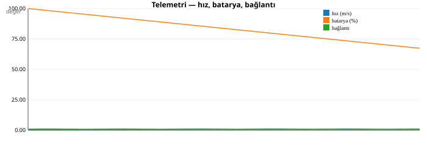
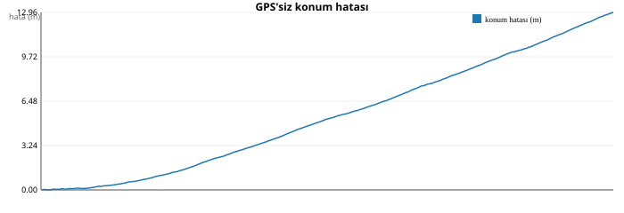
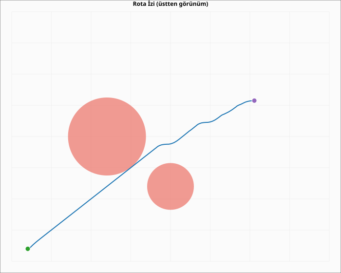

# TRUSTIA GÖREV RAPORU

- **Kayıt:** `C:\Users\Murat\Desktop\Trustia\Trustia\docs\reports\asama3\G-A02.jsonl`
- **Çerçeve sayısı:** 653

## 1. SONUÇ

| Alan | Değer |
|---|---|
| Görev kimliği | G-A02 |
| Görev tipi | lojistik |
| Başarı | EVET |
| Süre | 65.4 sn |
| Adım | 654 |
| Çarpışma | hayır |
| GPS'siz konum hatası (ort) | 5.4232 m |
| Rota sapması (ort) | 1.3572 m |
| Engel tepki süresi (ort) | 0.0 sn |

## 2. TELEMETRİ ÖZETİ

| Metrik | Değer |
|---|---|
| Ortalama hız | 0.58 m/s |
| Maksimum hız | 0.775 m/s |
| Ortalama konum hatası | 5.412 m |
| Maksimum konum hatası | 12.962 m |
| En düşük bağlantı kalitesi | 0.771 |
| Ortalama batarya | %83.65 |

## 3. GRAFİKLER

## 4. OLAYLAR

_Kayıtlı olay yok._

## 5. HATA ANALİZİ

Görev başarıyla tamamlandı; hata analizi gerekmedi.
